# Диаграммы

Исходники Mermaid (`.mmd`) и экспортированные SVG для архитектуры OmniRoute v3.8.0.

## Канонические диаграммы

| Исходник                                               | Экспорт                                   | Используется в                                                                  |
| ------------------------------------------------------ | ----------------------------------------- | ------------------------------------------------------------------------------- |
| [request-pipeline.mmd](./request-pipeline.mmd)       | [SVG](./exported/request-pipeline.svg)    | docs/architecture/ARCHITECTURE.md, docs/architecture/CODEBASE_DOCUMENTATION.md |
| [auto-combo-12factor.mmd](./auto-combo-12factor.mmd) | [SVG](./exported/auto-combo-12factor.svg) | docs/routing/AUTO-COMBO.md                                                     |
| [resilience-3layers.mmd](./resilience-3layers.mmd)   | [SVG](./exported/resilience-3layers.svg)  | docs/architecture/RESILIENCE_GUIDE.md, CLAUDE.md                               |
| [i18n-flow.mmd](./i18n-flow.mmd)                     | [SVG](./exported/i18n-flow.svg)           | docs/guides/I18N.md                                                            |
| [mcp-tools-94.mmd](./mcp-tools-94.mmd)               | [SVG](./exported/mcp-tools-94.svg)        | docs/frameworks/MCP-SERVER.md                                                  |
| [cloud-agent-flow.mmd](./cloud-agent-flow.mmd)       | [SVG](./exported/cloud-agent-flow.svg)    | docs/frameworks/CLOUD_AGENT.md                                                 |
| [authz-pipeline.mmd](./authz-pipeline.mmd)           | [SVG](./exported/authz-pipeline.svg)      | docs/architecture/AUTHZ_GUIDE.md                                               |
| [db-schema-overview.mmd](./db-schema-overview.mmd)   | [SVG](./exported/db-schema-overview.svg)  | docs/architecture/CODEBASE_DOCUMENTATION.md                                    |

## Ручные анимированные диаграммы

Не каждая диаграмма происходит из `.mmd` исходника. Ручные SVG живут в корне
этого каталога и анимированы только SMIL (без JS, без внешних шрифтов), поэтому они работают
в песочнице `` GitHub:

| Файл                                         | Используется в   | Примечания                                                                          |
| -------------------------------------------- | ---------------- | ----------------------------------------------------------------------------------- |
| [tier-cascade.svg](./tier-cascade.svg)       | README.md (корень) | Анимированный 4-уровневый каскад авто-фолбэка (цикл 16с, 4 акта). Редактируйте SVG напрямую — `.mmd` исходника нет. |
| [pool-fair-share.svg](./pool-fair-share.svg) | README.md (корень) | Анимированная квота fair-share пула ключей (generous → strict, цикл 16с). Редактируйте SVG напрямую — `.mmd` источника нет. |
| [combo-always-on.svg](./combo-always-on.svg) | README.md (корень) | Анимированный фолбэк приоритетного комбо (4 слоя, цикл 16с). Редактируйте SVG напрямую — `.mmd` источника нет. |
| [cli-terminal.svg](./cli-terminal.svg)       | README.md (корень) | Анимированный терминал, циклически показывающий 3 CLI-команды (providers/combo/health) + тикер подкоманд (цикл 18с). Редактируйте SVG напрямую. |
| [compression-pipeline.svg](./compression-pipeline.svg) | README.md (корень) | Анимированная воронка сжатия из 10 движков (цикл 8с). Редактируйте SVG напрямую. |
| [free-tier-budget.svg](./free-tier-budget.svg) | README.md (корень) | Анимированная карточка бюджета free-tier (~1.6B/мес заголовок, бюджет-бар 21 пула, сетка по моделям, кредиты при регистрации, цикл 10с). |

## Как обновить

1. Отредактируйте `*.mmd`.
2. Перерендерьте: `npm run docs:render-diagrams` (использует `@mermaid-js/mermaid-cli`).
3. Закоммитьте и `.mmd`, и `.svg`.

Если `@mermaid-js/mermaid-cli` не установлен локально, установите один раз:

```bash
npm install -g @mermaid-js/mermaid-cli
```

Скрипт рендерит каждый `.mmd` в `docs/diagrams/` в `docs/diagrams/exported/*.svg`
с белым фоном, подходящим для тёмной и светлой тем.

## Связывание из документа

Из документа в `docs/<подпапка>/` относительный путь становится `../diagrams/...`:

```markdown


> Источник: [../diagrams/request-pipeline.mmd](../diagrams/request-pipeline.mmd)
```

Из корня репозитория (например, `CLAUDE.md`):

```markdown

```

## Соглашения

- Одна концепция на диаграмму. Не пытайтесь уместить всю платформу в одну схему.
- Делайте подписи узлов короткими (3-6 слов). Используйте `<br/>` для переносов внутри узлов.
- Предпочитайте `flowchart LR` для конвейеров и `flowchart TB` для слоистых моделей.
- Используйте `sequenceDiagram` для интерактивных (запрос/ответ) потоков.
- Используйте `erDiagram` для обзоров схемы БД.
- Обновляйте и `.mmd`, и `.svg` в одном коммите. Держите их синхронизированными.
