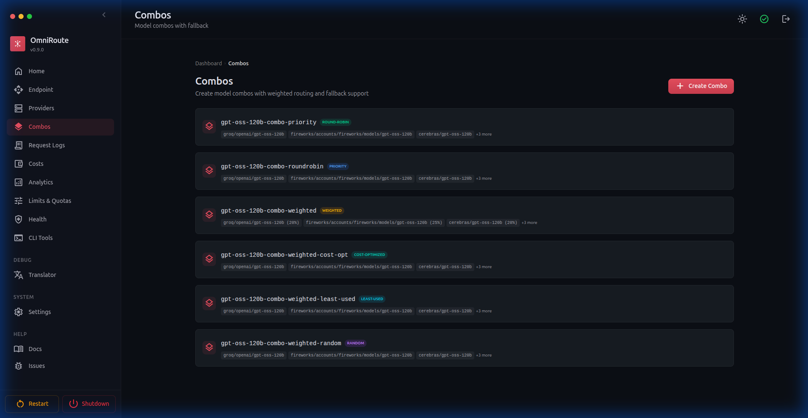
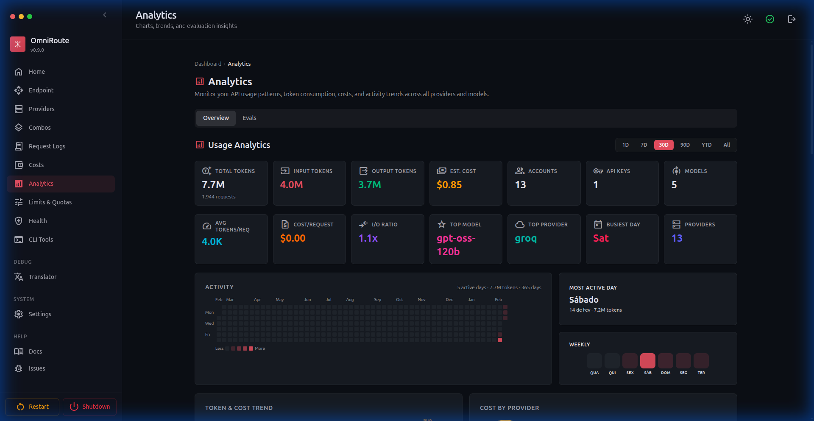
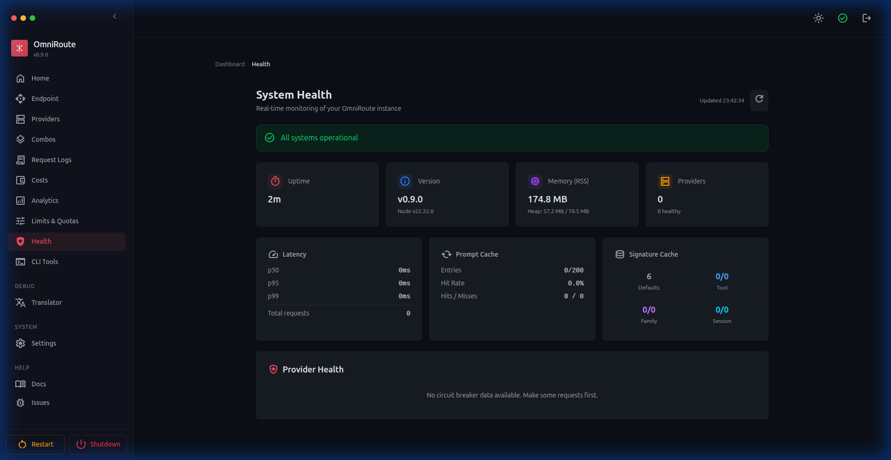
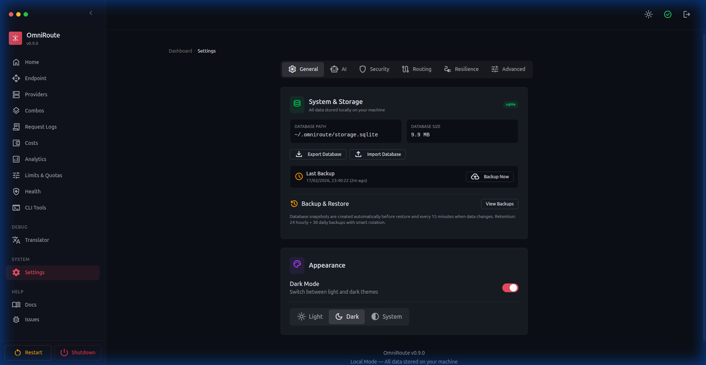
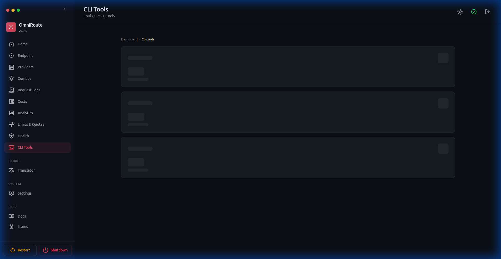
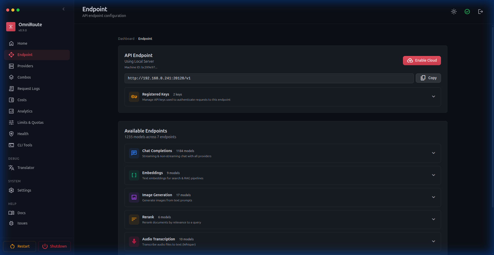

# OmniRoute — галерея возможностей панели управления

🌐 **Переводы основного README:** 🇺🇸 [English](../README.md) | 🇧🇷 [Português (Brasil)](../i18n/pt-BR/README.md) | 🇪🇸 [Español](../i18n/es/README.md) | 🇫🇷 [Français](../i18n/fr/README.md) | 🇮🇹 [Italiano](../i18n/it/README.md) | 🇷🇺 [Русский](../i18n/ru/README.md) | 🇨🇳 [中文 (简体)](../i18n/zh-CN/README.md) | 🇩🇪 [Deutsch](../i18n/de/README.md) | 🇮🇳 [हिन्दी](../i18n/in/README.md) | 🇹🇭 [ไทย](../i18n/th/README.md) | 🇺🇦 [Українська](../i18n/uk-UA/README.md) | 🇸🇦 [العربية](../i18n/ar/README.md) | 🇯🇵 [日本語](../i18n/ja/README.md) | 🇻🇳 [Tiếng Việt](../i18n/vi/README.md) | 🇧🇬 [Български](../i18n/bg/README.md) | 🇩🇰 [Dansk](../i18n/da/README.md) | 🇫🇮 [Suomi](../i18n/fi/README.md) | 🇮🇱 [עברית](../i18n/he/README.md) | 🇭🇺 [Magyar](../i18n/hu/README.md) | 🇮🇩 [Bahasa Indonesia](../i18n/id/README.md) | 🇰🇷 [한국어](../i18n/ko/README.md) | 🇲🇾 [Bahasa Melayu](../i18n/ms/README.md) | 🇳🇱 [Nederlands](../i18n/nl/README.md) | 🇳🇴 [Norsk](../i18n/no/README.md) | 🇵🇹 [Português (Portugal)](../i18n/pt/README.md) | 🇷🇴 [Română](../i18n/ro/README.md) | 🇵🇱 [Polski](../i18n/pl/README.md) | 🇸🇰 [Slovenčina](../i18n/sk/README.md) | 🇸🇪 [Svenska](../i18n/sv/README.md) | 🇵🇭 [Filipino](../i18n/phi/README.md) | 🇨🇿 [Čeština](../i18n/cs/README.md)

Визуальное руководство по каждому разделу панели управления OmniRoute.

> 📅 **Последнее обновление:** 2026-06-28 — **v3.8.40**

---

## ✨ Основные нововведения v3.8.0

Цикл v3.7.x → v3.8.0 добавил автоматическую маршрутизацию без конфигурации, новых провайдеров, OAuth-потоки, более глубокую отказоустойчивость и гораздо более богатый опыт CLI. Главные функции ниже — полные детали далее в документе и в связанных спецификациях.

- 🤖 **Auto Combo / автоматическая маршрутизация без конфигурации** — используйте префиксы `auto/coding`, `auto/fast`, `auto/cheap`, `auto/offline`, `auto/smart`, `auto/lkgp`. На базе 9-факторного движка оценки и 4 курируемых **пакетов режимов** (ship-fast, cost-saver, quality-first, offline-friendly)
- 🆕 **Провайдер Command Code** (#2199) — полноценная регистрация с каталогом моделей и отслеживанием квоты
- 🆕 **Провайдер Z.AI** — новый провайдер с бесплатным тарифом и метками квоты
- 🎬 **Расширение медиа KIE** — расширенный каталог, включая модели генерации видео
- 🔐 **OAuth-потоки Windsurf + Devin CLI** (#2168) — сквозной вход через браузер
- 🆓 **8 новых бесплатных провайдеров** — LLM7, Lepton, UncloseAI, BazaarLink, Completions, Enally, FreeTheAi, Command Code
- 🎯 **Маршрутизация по уровням с учётом манифестов W1–W4** — манифесты провайдеров управляют взвешенным выбором уровня
- 🎨 **Полный паритет Cursor с OpenAI** — вызовы инструментов, стриминг, управление сессиями от начала до конца
- 📊 **Использование плана Cursor Pro** — данные квоты и цикла выводятся на панель лимитов провайдеров
- ⚡ **Разбивка по уровням обслуживания / аналитика быстрого уровня Codex** — видимость потребления по уровням
- 📌 **Липкая маршрутизация по сессиям** — сессии Codex закрепляются за тем же аккаунтом между ходами
- 🔊 **Улучшения Inworld TTS** — каталоги голосов, стриминг и улучшения задержки
- 🔑 **Headless-авторизация Kiro** — вход через локальное SQLite-хранилище `kiro-cli`, браузер не требуется
- 📉 **Мониторинг квоты и лимитов DeepSeek** — дневное/месячное использование доступно в панели
- 🔄 **Стратегия маршрутизации с учётом сброса** — комбо теперь предпочитают аккаунты, у которых окно квоты сбрасывается раньше
- ⏱️ **`fallbackDelayMs`** и **динамическое определение лимита инструментов** — более тонкая настройка времени переключения + лимиты числа инструментов на провайдера
- 🔧 **Деградация фонового режима (Responses API)** — откат в синхронный режим со структурированным предупреждением, когда апстрим не поддерживает фоновый опрос
- 🚦 **Классификация 429 по провайдерам** + переключатель `useUpstream429BreakerHints` — более тонкое поведение выключателя с использованием подсказок апстрима о лимитах
- 🩺 **Панель охлаждений моделей** — наблюдение за отключениями отдельных моделей и ручное повторное включение из интерфейса
- 🔒 **Динамическое определение сертификатов MITM в Linux** — работает в Debian/Ubuntu, Fedora/RHEL, Arch и других дистрибутивах
- 💻 **Набор улучшений CLI** — 20+ команд, включая `omniroute providers`, `omniroute combos`, `omniroute doctor`, `omniroute setup`
- 🔍 **Обнаружение моделей эмбеддингов Qdrant** — автоматическое сканирование моделей векторного хранилища
- 🔑 **API-ключи / Bearer-ключи с областью `manage`** — выполнение административных операций программно через API
- 🏥 **Аналитика здоровья целей комбо** + **структурированный конструктор комбо** — здоровье по целям и UI-конструктор для сборки шагов `(provider, model, connection)`
- 🤝 **OAuth-провайдер GitLab Duo** — вход с учётными данными GitLab
- 🧠 **Кэш воспроизведения рассуждений** — гибридное хранение трассировок рассуждений в памяти + SQLite

📚 **Связанные документы:** [Фреймворк Skills](../frameworks/SKILLS.md) · [Система памяти](../frameworks/MEMORY.md) · [Облачные агенты](../frameworks/CLOUD_AGENT.md) · [Вебхуки](../frameworks/WEBHOOKS.md) · [Кэш воспроизведения рассуждений](../routing/REASONING_REPLAY.md)

---

## 🔌 Провайдеры

Управление подключениями ИИ-провайдеров: OAuth-провайдеры (Claude Code, Codex), провайдеры с API-ключом (Groq, DeepSeek, OpenRouter) и бесплатные провайдеры (Qoder, Qwen, Kiro). Аккаунты Kiro включают отслеживание баланса кредитов — оставшиеся кредиты, общая квота и дата продления видны в Dashboard → Usage.

Подключения OpenRouter могут хранить `preset` на уровне подключения в расширенных настройках. Когда задан, OmniRoute отправляет его как поле верхнего уровня запроса OpenRouter, например `"preset": "email-copywriter"`, если только запрос клиента уже не содержит собственный `preset`.

---

## 🎨 Комбо

Создавайте комбо маршрутизации моделей с 17 стратегиями: priority, weighted, fill-first, round-robin, p2c (power-of-two-choices), random, least-used, cost-optimized, reset-aware, reset-window, headroom, strict-random, auto, lkgp (last-known-good-provider), context-optimized, context-relay и **fusion** (параллельная рассылка панели моделей с последующим синтезом одного ответа через судью). Каждое комбо связывает несколько моделей с автоматическим переключением и включает быстрые шаблоны и проверки готовности.

Недавние улучшения комбо:

- **Структурированный конструктор комбо** — создавайте каждый шаг, выбирая провайдера, модель и точный аккаунт/подключение
- **Поддержка повторяющихся провайдеров** — используйте одного и того же провайдера много раз в одном комбо, пока кортеж `(provider, model, connection)` уникален
- **Здоровье целей комбо** — аналитика и поверхности здоровья теперь различают отдельные цели/шаги комбо вместо сворачивания всего в строки моделей
- **Составной порядок уровней** — `defaultTier -> fallbackTier` теперь влияет на порядок выполнения/переключения во время выполнения для шагов верхнего уровня комбо

---

## 📊 Аналитика

Всесторонняя аналитика использования с потреблением токенов, оценками расходов, тепловыми картами активности, графиками недельного распределения и разбивкой по провайдерам.

---

## 🏥 Здоровье системы

Мониторинг в реальном времени: аптайм, память, версия, перцентили задержки (p50/p95/p99), статистика кэша, состояния circuit breaker провайдеров, активные сессии с мониторингом квоты и здоровье целей комбо.

---

## 🔧 Песочница транслятора

Четыре режима отладки трансляций API: **Playground** (конвертер форматов), **Chat Tester** (живые запросы), **Test Bench** (пакетные тесты) и **Live Monitor** (поток в реальном времени).

---

## 🎮 Песочница моделей _(v2.0.9+)_

Тестируйте любую модель прямо из панели управления. Выбирайте провайдера, модель и эндпоинт, пишите промпты в Monaco Editor, получайте ответы потоком в реальном времени, прерывайте посреди потока и просматривайте метрики времени.

---

## 🎨 Темы _(v2.0.5+)_

Настраиваемые цветовые темы для всей панели управления. Выберите один из 7 предустановленных цветов (Coral, Blue, Red, Green, Violet, Orange, Cyan) или создайте собственную тему, выбрав любой hex-цвет. Поддерживает светлый, тёмный и системный режимы.

---

## ⚙️ Настройки

Всесторонняя панель настроек с **7 вкладками**:

- **General** — системное хранилище, управление резервными копиями (экспорт/импорт базы данных)
- **Appearance** — выбор темы (тёмная/светлая/системная), предустановки цветовых тем и пользовательские цвета, видимость журнала здоровья, элементы боковой панели и разделители групп, элементы управления видимостью туннелей Endpoint
- **AI** — функции ИИ-ассистента, предустановки маршрутизации по умолчанию (Auto Combo `auto/coding`, `auto/fast`, `auto/cheap`, `auto/smart`), кэш воспроизведения рассуждений и переключатели навыков/памяти
- **Security** — защита эндпоинтов API, блокировка пользовательских провайдеров, фильтрация IP, информация о сессии
- **Routing** — алиасы моделей, деградация фоновых задач, маршрутизация по уровням с учётом манифестов (W1–W4), `fallbackDelayMs`, липкая маршрутизация по сессиям
- **Resilience** — сохранение лимитов частоты, настройка circuit breaker, автоотключение забаненных аккаунтов, мониторинг истечения провайдеров, порог передачи **Context Relay** и конфигурация модели суммаризации, классификация 429 по провайдерам и переключатель `useUpstream429BreakerHints`, охлаждения моделей
- **Advanced** — переопределения конфигурации, аудит конфигурации, режим деградации переключения, деградация фонового режима для Responses API

---

## 🔧 CLI-инструменты

Настройка в один клик для ИИ-инструментов кодирования: Claude Code, Codex CLI, OpenClaw, Kilo Code, Antigravity, Cline, Continue, Cursor и Factory Droid. Включает автоматическое применение/сброс конфигурации, профили подключения и сопоставление моделей.

---

## 🤖 CLI-агенты _(v2.0.11+)_

Панель для обнаружения и управления CLI-агентами. Показывает сетку из 17 встроенных агентов (Codex, Claude, Goose, OpenClaw, Aider, OpenCode, Cline, Qwen Code, ForgeCode, Amazon Q, Open Interpreter, Cursor CLI, Warp, **Windsurf**, **Devin CLI**, **Kimi Coding**, **Command Code**) с:

- **Статусом установки** — Installed / Not Found с определением версии
- **Значками протоколов** — stdio, HTTP и т.д.
- **Пользовательскими агентами** — регистрация любого CLI-инструмента через форму (имя, бинарник, команда версии, аргументы запуска)
- **Сопоставлением отпечатков CLI** — переключатель на провайдера для сопоставления нативных сигнатур запросов CLI, снижающий риск бана с сохранением IP прокси
- **Агентами на OAuth** — Windsurf и Devin CLI теперь используют браузерные OAuth-потоки для аутентификации (v3.8.0+)

---

## 🔗 Context Relay _(v3.5.5+)_

Стратегия комбо, сохраняющая непрерывность сессии, когда ротация аккаунтов происходит посреди диалога. Прежде чем активный аккаунт исчерпается, OmniRoute генерирует структурированную сводку передачи в фоне. После того как следующий запрос разрешается в другой аккаунт, сводка внедряется как системное сообщение, чтобы новый аккаунт продолжил с полным контекстом.

Настраивается через настройки уровня комбо или глобальные:

- **Handoff Threshold** — процент использования квоты, запускающий генерацию сводки (по умолчанию 85%)
- **Max Messages For Summary** — сколько недавней истории сжимать
- **Summary Model** — опциональная замена модели для генерации сводки передачи

В настоящее время поддерживает ротацию аккаунтов Codex. См. [документацию Context Relay](../architecture/ARCHITECTURE.md).

---

## 🗜️ Сжатие промптов _(v3.7.9+)_

Context & Cache теперь предоставляет выделенные страницы для Caveman, RTK и Compression Combos:

- **Caveman** — языково-ориентированные пакеты правил, предпросмотр, управление режимом вывода и аналитика
- **RTK** — сжатие с учётом команд для вывода shell, git, тестов, сборки, пакетов, Docker, инфраструктуры, JSON и стектрейсов
- **Compression Combos** — именованные конвейеры, такие как `rtk -> caveman`, назначаемые комбо маршрутизации; математика стека по умолчанию достигает `~89%` в среднем и `78-95%` экономии подходящего контекста, когда применяются оба движка
- **Восстановление сырого вывода** — опциональные отредактированные указатели RTK на сырой вывод для отладки сбоев сжатия

См. [Руководство по сжатию](../compression/COMPRESSION_GUIDE.md), [Сжатие RTK](../compression/RTK_COMPRESSION.md) и
[Движки сжатия](../compression/COMPRESSION_ENGINES.md).

---

## 🛡️ Усиление прокси _(v3.5.5+)_

Всестороннее применение конфигурации прокси по всему конвейеру запросов:

- **Проверка здоровья токенов** — фоновое обновление OAuth теперь разрешает конфигурацию прокси для каждого подключения, предотвращая сбои в средах, требующих прокси
- **Валидация API-ключей** — валидация ключей провайдеров (`POST /api/providers/validate`) проходит через `runWithProxyContext`, учитывая настройки прокси на уровне провайдера и глобальные
- **Исправление диспетчера undici** — диспетчеры прокси используют собственную реализацию fetch из undici вместо встроенного fetch Node, устраняя ошибки `invalid onRequestStart method` на Node.js 22
- **Определение версии Node.js** — страница входа проактивно определяет несовместимые версии Node.js (24+) и отображает предупреждающий баннер с инструкциями использовать Node 22 LTS

---

## 📧 Маскирование email для приватности _(v3.5.6+)_

Email OAuth-аккаунтов маскируются по умолчанию (напр. `di*****@g****.com`), чтобы предотвратить случайное раскрытие при публикации скриншотов или записи демо. Используйте Settings → Appearance → Account email visibility, чтобы показывать или маскировать полные email аккаунтов глобально на экранах провайдеров, комбо, логов, квоты и песочницы.

---

## 👁️ Переключатель видимости моделей _(v3.5.6+)_

Список моделей на странице провайдера теперь включает:

- **Строку поиска/фильтрации в реальном времени** — быстрый поиск конкретных моделей
- **Переключатель видимости на каждую модель** (иконка 👁) — скрытые модели затенены и исключены из каталога `/v1/models`
- **Значок активного числа** (`N/M active`) — показывает с первого взгляда, сколько моделей включено из общего числа

---

## 🔧 Восстановление окружения OAuth _(v3.6.1+)_

Действие «Repair env» в один клик для OAuth-провайдеров, восстанавливающее недостающие переменные окружения и исправляющее сломанное состояние авторизации. Доступно из `Dashboard → Providers → [OAuth Provider] → Repair env`. Автоматически обнаруживает и восстанавливает:

- Отсутствующие учётные данные OAuth-клиента
- Повреждённые записи файла окружения
- Санитизацию пути резервных копий

---

## 🗑️ Удаление / Полное удаление _(v3.6.2+)_

Скрипты чистого удаления для всех способов установки:

| Команда                  | Действие                                                                                     |
| ------------------------ | -------------------------------------------------------------------------------------------- |
| `npm run uninstall`      | Удаляет системное приложение, но **сохраняет вашу БД и конфигурации** в `~/.omniroute`.      |
| `npm run uninstall:full` | Удаляет приложение И безвозвратно **стирает все конфигурации, ключи и базы данных**.         |

---

## 🖼️ Медиа _(v2.0.3+)_

Генерируйте изображения, видео и музыку из панели управления. Поддерживаются OpenAI, xAI, Together, Hyperbolic, SD WebUI, ComfyUI, AnimateDiff, Stable Audio Open и MusicGen.

---

## 📝 Журналы запросов

Логирование запросов в реальном времени с фильтрацией по провайдеру, модели, аккаунту и API-ключу. Показывает коды статуса, использование токенов, задержку и детали ответа.

---

## 🌐 API-эндпоинт

Ваш единый API-эндпоинт с разбивкой по возможностям: Chat Completions, Responses API, Embeddings, генерация изображений, реранжирование, транскрипция аудио, синтез речи, модерация и зарегистрированные API-ключи. Для удалённого доступа доступны Cloudflare Quick Tunnel, Tailscale Funnel, ngrok Tunnel и поддержка облачного прокси.

---

## 🔑 Управление API-ключами

Создавайте, ограничивайте область и отзывайте API-ключи. Каждый ключ может быть ограничен конкретными моделями/провайдерами с полным доступом или правами только на чтение. Визуальное управление ключами с отслеживанием использования.

---

## 📋 Журнал аудита

Отслеживание административных действий с фильтрацией по типу действия, инициатору, цели, IP-адресу и метке времени. Полная история событий безопасности.

---

## 🖥️ Десктопное приложение

Нативное десктопное приложение Electron для Windows, macOS и Linux. Запускайте OmniRoute как автономное приложение с интеграцией системного трея, поддержкой офлайна, автообновлением и установкой в один клик.

Ключевые возможности:

- Опрос готовности сервера (нет пустого экрана при холодном старте)
- Системный трей с управлением портами
- Content Security Policy
- Блокировка единственного экземпляра
- Автообновление при перезапуске
- UI с учётом платформы (кнопки traffic lights на macOS, стандартная строка заголовка Windows/Linux)
- Усиленная упаковка сборки Electron — симлинкованные `node_modules` в standalone-бандле обнаруживаются и отклоняются перед упаковкой, предотвращая зависимость среды выполнения от сборочной машины (v2.5.5+)
- **Корректное завершение** — `before-quit` Electron корректно выключает Next.js, предотвращая блокировки базы данных SQLite WAL (v3.6.2+)

📖 Полную документацию см. в [`electron/README.md`](../../electron/README.md).

---

## 🌐 WebSocket-мост V1 _(v3.6.6+)_

OmniRoute теперь поддерживает **OpenAI-совместимых WebSocket-клиентов** через эндпоинт обновления `/v1/ws`. Пользовательский сервер `scripts/dev/v1-ws-bridge.mjs` оборачивает Next.js и обновляет WS-соединения до полных двунаправленных потоковых сессий. Аутентификация использует тот же API-ключ или сессионный cookie, что и HTTP-запросы.

Ключевое поведение:

- Обновление WS валидируется `src/lib/ws/handshake.ts` до установления соединения
- Потоки корректно завершаются при закрытии сессии или ошибке апстрима
- Работает параллельно с существующим путём потоковой передачи HTTP+SSE

---

## 🔑 Токены синхронизации и бандл конфигурации _(v3.6.6+)_

Многоустройственный и внешний операторский доступ теперь возможен через **токены синхронизации с областью**:

- **`POST /api/sync/tokens`** — выпустить новый токен синхронизации (с областью, опциональным сроком действия)
- **`DELETE /api/sync/tokens/:id`** — отозвать токен
- **`GET /api/sync/bundle`** — скачать версионированный JSON-снимок всех несекретных настроек с ключом ETag (пароли отредактированы)

Бандл конфигурации собирается `src/lib/sync/bundle.ts`. Потребители сравнивают заголовок ответа `ETag`, чтобы обнаруживать изменения без повторного скачивания всей нагрузки.

---

## 🧠 Пресет GLM Thinking _(v3.6.6+)_

**GLM Thinking (`glmt`)** теперь зарегистрирован как полноценный провайдер: 65 536 макс. выходных токенов, бюджет thinking 24 576, таймаут по умолчанию 900 с, Claude-совместимый формат API и общая синхронизация использования с семейством GLM.

**Гибридный подсчёт токенов** также появился в v3.6.6: когда Claude-совместимый провайдер предоставляет `/messages/count_tokens`, OmniRoute вызывает его перед большими запросами с корректным откатом на оценку.

---

## 🛡️ Безопасные исходящие запросы и защита от SSRF _(v3.6.6+)_

Все вызовы валидации провайдеров и обнаружения моделей теперь проходят через двухуровневую исходящую защиту:

1. **Защита URL** (`src/shared/network/outboundUrlGuard.ts`) — блокирует диапазоны приватных/loopback/link-local IP до открытия сокета.
2. **Обёртка безопасного fetch** (`src/shared/network/safeOutboundFetch.ts`) — применяет защиту URL, нормализует таймауты и повторяет временные ошибки с экспоненциальной задержкой.

Нарушения защиты выдаются как HTTP 422 (`URL_GUARD_BLOCKED`) и записываются в журнал аудита соответствия через `providerAudit.ts`.

---

## 🔄 Повторы с учётом охлаждения _(v3.6.6+)_

Запросы чата теперь **автоматически повторяются**, когда апстрим-провайдер возвращает охлаждение в разрезе модели. Настраивается через `REQUEST_RETRY` (по умолчанию: 2) и `MAX_RETRY_INTERVAL_SEC` (по умолчанию: 30 с). Обучение по заголовкам лимитов улучшено для `x-ratelimit-reset-requests`, `x-ratelimit-reset-tokens` и `Retry-After` — состояние охлаждения по моделям видно в панели Resilience.

---

## 📋 Аудит соответствия v2 _(v3.6.6+)_

Журнал аудита расширен курсорной пагинацией, обогащением контекстом запроса (ID запроса, user agent, IP), структурированными событиями авторизации, событиями CRUD провайдеров с контекстом различий и логированием SSRF-заблокированной валидации. Новые события генерируются `src/lib/compliance/providerAudit.ts`.
