# i18n — руководство по интернационализации

OmniRoute поддерживает **43 языка** с полным переводом интерфейса панели управления, переведённой документацией и поддержкой RTL для арабского и иврита.

🌐 **Языки:** 🇺🇸 [English](./I18N.md) | 🇧🇷 [Português (Brasil)](../i18n/pt-BR/docs/guides/I18N.md) | 🇪🇸 [Español](../i18n/es/docs/guides/I18N.md) | 🇫🇷 [Français](../i18n/fr/docs/guides/I18N.md) | 🇩🇪 [Deutsch](../i18n/de/docs/guides/I18N.md) | 🇮🇹 [Italiano](../i18n/it/docs/guides/I18N.md) | 🇷🇺 [Русский](../i18n/ru/docs/guides/I18N.md) | 🇨🇳 [中文 (简体)](../i18n/zh-CN/docs/guides/I18N.md) | 🇯🇵 [日本語](../i18n/ja/docs/guides/I18N.md) | 🇰🇷 [한국어](../i18n/ko/docs/guides/I18N.md) | 🇸🇦 [العربية](../i18n/ar/docs/guides/I18N.md) | 🇮🇳 [हिन्दी](../i18n/hi/docs/guides/I18N.md) | 🇹🇭 [ไทย](../i18n/th/docs/guides/I18N.md) | 🇹🇷 [Türkçe](../i18n/tr/docs/guides/I18N.md) | 🇺🇦 [Українська](../i18n/uk-UA/docs/guides/I18N.md) | 🇻🇳 [Tiếng Việt](../i18n/vi/docs/guides/I18N.md) | 🇧🇬 [Български](../i18n/bg/docs/guides/I18N.md) | 🇩🇰 [Dansk](../i18n/da/docs/guides/I18N.md) | 🇫🇮 [Suomi](../i18n/fi/docs/guides/I18N.md) | 🇮🇱 [עברית](../i18n/he/docs/guides/I18N.md) | 🇭🇺 [Magyar](../i18n/hu/docs/guides/I18N.md) | 🇮🇩 [Bahasa Indonesia](../i18n/id/docs/guides/I18N.md) | 🇲🇾 [Bahasa Melayu](../i18n/ms/docs/guides/I18N.md) | 🇳🇱 [Nederlands](../i18n/nl/docs/guides/I18N.md) | 🇳🇴 [Norsk](../i18n/no/docs/guides/I18N.md) | 🇵🇹 [Português (Portugal)](../i18n/pt/docs/guides/I18N.md) | 🇷🇴 [Română](../i18n/ro/docs/guides/I18N.md) | 🇵🇱 [Polski](../i18n/pl/docs/guides/I18N.md) | 🇸🇰 [Slovenčina](../i18n/sk/docs/guides/I18N.md) | 🇸🇪 [Svenska](../i18n/sv/docs/guides/I18N.md) | 🇵🇭 [Filipino](../i18n/phi/docs/guides/I18N.md) | 🇨🇿 [Čeština](../i18n/cs/docs/guides/I18N.md)

## Конвейер перевода (рекомендуется — v3.8.0)

OmniRoute использует инкрементальный переводчик документации на основе хэшей, работающий через
OpenAI-совместимый LLM-эндпоинт (обычно `cx/gpt-5.4-mini` через
OmniRoute Cloud):

```bash
# Запустить переводы (инкрементально — затрагивает только изменённые источники)
npm run i18n:run

# Ограничить одной локалью
npm run i18n:run -- --locale=pt-BR

# Конкретные файлы (через запятую, пути относительно репозитория)
npm run i18n:run -- --files=CLAUDE.md,docs/architecture/ARCHITECTURE.md

# Принудительно перевести всё заново (дорого)
npm run i18n:run -- --force

# Предпросмотр того, что произойдёт (без вызовов API, без записи)
npm run i18n:run:dry

# Проверка для CI — ненулевой код выхода, если состояние расходится
npm run i18n:check
```

**Источник истины.** `config/i18n.json` перечисляет все локали (UI + документация) плюс
набор RTL и коды `docsExcluded`. Конфигурация среды выполнения в
`src/i18n/config.ts` — тонкий адаптер над этим JSON.

**Бэкенд.** Настраивается через окружение (задаётся в `.env`, никогда не коммитится):

| Переменная                          | Назначение                              |
| ----------------------------------- | --------------------------------------- |
| `OMNIROUTE_TRANSLATION_API_URL`     | OpenAI-совместимый base URL, напр. `…/v1` |
| `OMNIROUTE_TRANSLATION_API_KEY`     | bearer-токен (не попадает в логи)       |
| `OMNIROUTE_TRANSLATION_MODEL`       | ID модели, напр. `cx/gpt-5.4-mini`      |
| `OMNIROUTE_TRANSLATION_TIMEOUT_MS`  | опционально, по умолчанию `60000`       |
| `OMNIROUTE_TRANSLATION_CONCURRENCY` | опционально, по умолчанию `4`           |

**Отслеживание состояния.** `.i18n-state.json` (в коммите) хранит хэши SHA-256 для каждого
источника + каждой локали. Обнаружение расхождения автоматическое и детерминированное — без вызовов
API в `i18n:check`.

**Форма вывода.** Каждый переведённый файл получает строку верхнего уровня `# <заголовок>
(<native>)`, панель `🌐 Languages: …`, разделитель `---` и
переведённое тело. Такая раскладка соответствует тому, что `scripts/check/check-docs-sync.mjs`
уже применяет к зеркалам `llm.txt` и `CHANGELOG.md`.

### Устаревшие скрипты (deprecated)

Старый Python-скрипт (`scripts/i18n/i18n_autotranslate.py`) и
генератор на базе Google Translate (`scripts/i18n/generate-multilang.mjs`)
всё ещё существуют с баннером об устаревании. Они будут удалены в v3.10. Режимы
`messages` и `readme` генератора `generate-multilang.mjs` (строки UI + варианты корневого
README) пока не обрабатываются новым конвейером и всё ещё используются.

## Краткий справочник

| Задача                  | Команда                                                      |
| ----------------------- | ------------------------------------------------------------ |
| Перевести документы (LLM) | `npm run i18n:run` (предпочтительно — инкрементально, на хэшах) |
| Перевести строки UI     | `node scripts/i18n/generate-multilang.mjs messages`          |
| Проверить расхождение переводов | `npm run i18n:check`                                   |
| Валидировать локаль      | `python3 scripts/i18n/validate_translation.py quick -l cs`   |
| Проверить ключи в коде  | `python3 scripts/i18n/check_translations.py`                 |
| Сгенерировать QA-отчёт   | `node scripts/i18n/generate-qa-checklist.mjs`                |
| Визуальный QA (Playwright) | `node scripts/i18n/run-visual-qa.mjs`                     |

## Архитектура



> Источник: [diagrams/i18n-flow.mmd](../diagrams/i18n-flow.mmd)

### Источник истины

- **Строки UI**: `src/i18n/messages/en.json` (английский источник, ~2800 ключей)
- **Файлы локалей**: `src/i18n/messages/{locale}.json` (30 переводов)
- **Фреймворк**: `next-intl` с определением локали по cookie
- **Конфиг**: `src/i18n/config.ts` — определяет все 30 локалей, названия языков, флаги

### Поток выполнения

1. Пользователь выбирает язык → устанавливается cookie `NEXT_LOCALE`
2. `src/i18n/request.ts` разрешает локаль: cookie → заголовок `Accept-Language` → откат `en`
3. Динамический импорт загружает `messages/{locale}.json`
4. Компоненты используют `useTranslations("namespace")` и `t("key")`

### Поддерживаемые локали

| Код     | Язык                 | RTL | Код Google Translate |
| ------- | -------------------- | --- | -------------------- |
| `ar`    | العربية              | Да  | `ar`                 |
| `bg`    | Български            | Нет | `bg`                 |
| `cs`    | Čeština              | Нет | `cs`                 |
| `da`    | Dansk                | Нет | `da`                 |
| `de`    | Deutsch              | Нет | `de`                 |
| `es`    | Español              | Нет | `es`                 |
| `fi`    | Suomi                | Нет | `fi`                 |
| `fr`    | Français             | Нет | `fr`                 |
| `he`    | עברית                | Да  | `iw`                 |
| `hi`    | हिन्दी               | Нет | `hi`                 |
| `hu`    | Magyar               | Нет | `hu`                 |
| `id`    | Bahasa Indonesia     | Нет | `id`                 |
| `it`    | Italiano             | Нет | `it`                 |
| `ja`    | 日本語               | Нет | `ja`                 |
| `ko`    | 한국어               | Нет | `ko`                 |
| `ms`    | Bahasa Melayu        | Нет | `ms`                 |
| `nl`    | Nederlands           | Нет | `nl`                 |
| `no`    | Norsk                | Нет | `no`                 |
| `phi`   | Filipino             | Нет | `tl`                 |
| `pl`    | Polski               | Нет | `pl`                 |
| `pt`    | Português (Portugal) | Нет | `pt`                 |
| `pt-BR` | Português (Brasil)   | Нет | `pt`                 |
| `ro`    | Română               | Нет | `ro`                 |
| `ru`    | Русский              | Нет | `ru`                 |
| `sk`    | Slovenčина           | Нет | `sk`                 |
| `sv`    | Svenska              | Нет | `sv`                 |
| `th`    | ไทย                  | Нет | `th`                 |
| `tr`    | Türkçe               | Нет | `tr`                 |
| `uk-UA` | Українська           | Нет | `uk`                 |
| `vi`    | Tiếng Việt           | Нет | `vi`                 |
| `zh-CN` | 中文 (简体)          | Нет | `zh-CN`              |
| `zh-TW` | 中文 (繁體)          | Нет | `zh-TW`              |

## Добавление нового языка

### 1. Зарегистрируйте локаль

Отредактируйте `src/i18n/config.ts`:

```ts
// Добавить в массив LOCALES
"xx",
// Добавить в массив LANGUAGES
{ code: "xx", label: "XX", name: "Language Name", flag: "🏳️" },
```

### 2. Добавьте в генератор

Отредактируйте `scripts/i18n/generate-multilang.mjs` — добавьте запись в `LOCALE_SPECS`:

```js
{
  code: "xx",
  googleTl: "xx",
  label: "XX",
  flag: "🏳️",
  languageName: "Language Name",
  readmeName: "Language Name",
  docsName: "Language Name",
},
```

### 3. Сгенерируйте начальный перевод

```bash
node scripts/i18n/generate-multilang.mjs messages
```

Это создаёт `src/i18n/messages/xx.json`, автоматически переведённый из `en.json` через Google Translate.

### 4. Проверьте и исправьте автоперевод

Автоматические переводы — это отправная точка. Проверьте вручную на предмет:

- Технической точности
- Терминологии, уместной в контексте
- Корректной обработки плейсхолдеров (`{count}`, `{value}` и т.д.)

### 5. Валидируйте

```bash
python3 scripts/i18n/validate_translation.py quick -l xx
python3 scripts/i18n/validate_translation.py diff common -l xx
```

### 6. Сгенерируйте переведённую документацию

```bash
node scripts/i18n/generate-multilang.mjs docs
```

## Конвейер автоперевода

### generate-multilang.mjs (Google Translate)

**Основной движок автоперевода** — использует бесплатный API Google Translate для генерации переводов строк UI, README и документации.

```bash
node scripts/i18n/generate-multilang.mjs [messages|readme|docs|all]
```

| Режим      | Что делает                                                                    |
| ---------- | ----------------------------------------------------------------------------- |
| `messages` | Переводит недостающие ключи в `src/i18n/messages/{locale}.json` из `en.json`  |
| `readme`   | Переводит `README.md` на все локали как `README.{code}.md` в корне проекта    |
| `docs`     | Переводит `DOC_SOURCE_FILES` в `docs/i18n/{locale}/{docName}`                 |
| `all`      | Запускает все три режима                                                      |

**Возможности:**

- **Защита текста**: маскирует блоки кода (` ``` `), встроенный код (`` ` ``), markdown-ссылки/изображения (`[text](url)`), HTML-теги, таблицы и ICU-плейсхолдеры (`{count}`, `{value}`, `{total}` и т.д.) перед переводом, затем восстанавливает их
- **Пакетирование чанками**: объединяет несколько строк разделителями `__OMNIROUTE_I18N_SEPARATOR__` для минимизации вызовов API (макс. 1800 символов на запрос)
- **Кэш в памяти**: избегает избыточных вызовов API для повторяющихся строк в рамках сессии
- **Логика повторов**: экспоненциальная задержка (до 5 попыток с задержкой 300 мс × попытка) для ошибок 429/5xx
- **Таймаут**: 20 секунд на запрос
- **Пропуск существующих**: если целевой файл уже существует, он НЕ перезаписывается

**Важное поведение:**

- `docs/i18n/README.md` **перегенерируется** при каждом запуске — это автогенерируемый указатель всех документов
- Корневые файлы `README.{code}.md` создаются только если их нет (пропускает локали из `EXISTING_README_CODES`)
- Языковые панели (`🌐 **Languages:** ...`) автоматически вставляются/обновляются во всех переведённых документах

### i18n_autotranslate.py (на базе LLM)

**Вторичный переводчик** — использует любой OpenAI-совместимый LLM API (включая сам OmniRoute) для перевода существующих markdown-файлов `docs/i18n/`. Лучше всего подходит для полировки или повторного перевода документации с качеством выше, чем у Google Translate.

```bash
python3 scripts/i18n/i18n_autotranslate.py \
  --api-url http://localhost:20128/v1 \
  --api-key sk-your-key \
  --model gpt-4o
```

**Возможности:**

- Сканирует markdown-файлы `docs/i18n/` на предмет английских абзацев
- Пропускает блоки кода, таблицы и уже переведённый контент
- Отправляет абзацы в LLM с системным промптом технического перевода
- Поддерживает все 43 языка

## CLI i18n

CLI `omniroute` имеет собственный слой i18n, отдельный от панели Next.js.

### Как это работает

- Каждая видимая пользователю строка в командах CLI проходит через `t("module.key", vars)` из `bin/cli/i18n.mjs`.
- Каталоги — JSON-файлы в `bin/cli/locales/` — 43 поставляются из коробки.
- Локаль откатывается к `en` для любого отсутствующего ключа, поэтому частичные переводы валидны.
- Источник истины по доступным локалям — `config/i18n.json` (общий с панелью).

### Выбор локали

Порядок определения (побеждает первое совпадение):

| Приоритет | Источник                 | Пример                                  |
| --------- | ------------------------ | --------------------------------------- |
| 1         | Флаг `--lang`            | `omniroute --lang de status`            |
| 2         | Переменная `OMNIROUTE_LANG` | `OMNIROUTE_LANG=ja omniroute providers` |
| 3         | Системная `LC_ALL`       | автоопределение из локали терминала     |
| 4         | Системная `LC_MESSAGES`  | автоопределение из локали терминала     |
| 5         | Системная `LANG`         | автоопределение из локали терминала     |
| 6         | Откат                    | `en`                                    |

Коды локалей с подчёркиваниями (`pt_BR`) нормализуются к форме с дефисом (`pt-BR`).
Коды локалей валидируются по `/^[a-zA-Z0-9-]+$/` — обход пути отклоняется.

### Сохранение языкового предпочтения

```bash
# Задать язык и сохранить в ~/.omniroute/.env (сохраняется между сессиями)
omniroute config lang set pt-BR

# Показать текущий язык
omniroute config lang get

# Вывести все 42 доступных языка
omniroute config lang list

# Вывод JSON
omniroute config lang list --output json
```

Сохранённое предпочтение атомарно записывается в `~/.omniroute/.env` и загружается
загрузчиком CLI перед выполнением любой команды.

### Разовое переопределение

```bash
# Переопределить только для одной команды (не сохраняется)
omniroute --lang de providers list
```

Примечание: флаг `--lang` НЕ записывает в файл окружения — он влияет только на текущий
вызов. Используйте `config lang set` для сохранения.

### Доступные локали

43 файла локалей поставляются в `bin/cli/locales/`. Полные переводы: `en`, `pt-BR`.
Только каркас (все ключи откатываются к `en`): `bn`, `gu`, `he`, `in`, `mr`, `ms`, `phi`, `sw`, `ta`, `te`, `ur`.
Во всех остальных 29 локалях переведены ключи `common` + `program`.

### Добавление новой локали CLI

1. Добавьте запись локали в `config/i18n.json`.
2. Запустите `node bin/cli/scripts/generate-locales.mjs` — создаёт файл локали.
3. Переведите ключи (или оставьте `{}` для каркаса с откатом к en).
4. PR должны добавлять строки в `en.json` и `pt-BR.json`; остальные файлы — по возможности.

## Валидация и QA

### validate_translation.py

**Валидатор переводов** — сравнивает любой JSON локали с `en.json` и сообщает о проблемах.

```bash
# Быстрая проверка (только счётчики)
python3 scripts/i18n/validate_translation.py quick -l cs
# Вывод:
# Missing: 0
# Untranslated: 0
# Ignored (UNTRANSLATABLE_KEYS): 236

# Подробный diff по категории
python3 scripts/i18n/validate_translation.py diff common -l cs
python3 scripts/i18n/validate_translation.py diff settings -l cs

# Экспорт в CSV
python3 scripts/i18n/validate_translation.py csv -l cs > report.csv

# Экспорт в Markdown
python3 scripts/i18n/validate_translation.py md -l cs > report.md

# Полный отчёт (по умолчанию)
python3 scripts/i18n/validate_translation.py -l cs
```

**Обнаруживает:**

- **Отсутствующие ключи** — ключи есть в `en.json`, но нет в файле локали
- **Лишние ключи** — ключи есть в файле локали, но нет в `en.json`
- **Непереведённые ключи** — ключи, где значение локали равно английскому источнику (кроме списка исключений)
- **Несовпадения плейсхолдеров** — ICU-плейсхолдеры, не совпадающие между источником и переводом

**Коды выхода:**

| Код | Значение                     |
| --- | ---------------------------- |
| 0   | OK                           |
| 1   | Общая ошибка                 |
| 2   | Отсутствуют строки (жёсткая ошибка) |
| 3   | Предупреждение о непереведённых (мягкое) |

**Окружение:** задайте `TRANSLATION_LANG=cs` или используйте флаг `-l cs`.

### check_translations.py

**Проверка ключей код→JSON** — сканирует `src/**/*.tsx` и `src/**/*.ts` на вызовы `useTranslations()` и проверяет, что все упомянутые ключи существуют в `en.json`.

```bash
# Базовая проверка
python3 scripts/i18n/check_translations.py

# Подробный вывод
python3 scripts/i18n/check_translations.py --verbose

# Автоисправление (добавляет отсутствующие ключи в en.json)
python3 scripts/i18n/check_translations.py --fix
```

### generate-qa-checklist.mjs

**QA статическим анализом** — сканирует файлы страниц Next.js на метрики риска i18n и генерирует отчёт Markdown.

```bash
node scripts/i18n/generate-qa-checklist.mjs
```

**Проверяет:**

- Использование классов фиксированной ширины (риск переполнения)
- Направленные классы left/right (риск RTL)
- Паттерны, склонные к обрезке
- Паритет локалей (отсутствующие/лишние ключи относительно `en.json`)
- Панели выбора языка в README приоритетных локалей (`es`, `fr`, `de`, `ja`, `ar`)

**Вывод:** `docs/reports/i18n-qa-checklist-{date}.md`

### run-visual-qa.mjs

**Визуальный QA через Playwright** — делает скриншоты всех маршрутов панели в нескольких локалях и вьюпортах, затем оценивает здоровье страниц.

```bash
# По умолчанию: es, fr, de, ja, ar на localhost:20128
node scripts/i18n/run-visual-qa.mjs

# Пользовательский base URL и локали
QA_BASE_URL=http://staging.example.com QA_LOCALES=de,fr node scripts/i18n/run-visual-qa.mjs

# Пользовательские маршруты
QA_ROUTES=/dashboard/settings,/dashboard/providers node scripts/i18n/run-visual-qa.mjs
```

**Обнаруживает:**

- Переполнение текста
- Обрезку элементов
- Несоответствия раскладки RTL

**Вывод:** `docs/reports/i18n-visual-qa-{date}.md` + JSON-отчёт

## Управление непереводимыми ключами

### untranslatable-keys.json

**Файл:** `scripts/i18n/untranslatable-keys.json`

Список исключений ключей, которые должны оставаться идентичными английскому источнику. Используется `validate_translation.py`, чтобы избежать ложных предупреждений «не переведено».

```json
{
  "description": "Keys that should remain untranslated...",
  "keys": [
    "common.model",
    "common.oauth",
    "health.cpu",
    ...
  ]
}
```

**Что сюда относится:**

- Имена брендов/продуктов: `landing.brandName`, `common.social-github`
- Технические термины/аббревиатуры: `health.cpu`, `mcpDashboard.pid`, `settings.ai`
- Строки ICU/форматов: `apiManager.modelsCount`, `health.millisecondsShort`
- Значения плейсхолдеров: `providers.openaiBaseUrlPlaceholder`, `cliTools.baseUrlPlaceholder`
- Названия протоколов: `common.http`, `common.oauth`, `providers.oauth2Label`
- Разделы навигации: `sidebar.primarySection`, `sidebar.cliSection`

**Чтобы добавить ключ:** отредактируйте массив `keys` в `scripts/i18n/untranslatable-keys.json` и запустите валидацию заново.

## Интеграция CI

### GitHub Actions (`.github/workflows/ci.yml`)

Конвейер CI валидирует все локали на каждый push и PR:

1. **Задание `i18n-matrix`** — динамически обнаруживает все файлы локалей (кроме `en.json`)
2. **Задание `i18n`** — запускает `validate_translation.py quick -l '<lang>'` для каждой локали параллельно
3. **Задание `ci-summary`** — агрегирует результаты в сводку панели

```yaml
# i18n-matrix: обнаруживает языки
LANGS=$(ls src/i18n/messages/*.json | xargs -n1 basename | sed 's/.json$//' | grep -v '^en$')

# i18n: валидирует каждый язык
python3 scripts/i18n/validate_translation.py quick -l '${{ matrix.lang }}'
```

**Вывод на панель:**

```
## 🌍 Translations
| Metric | Value |
|--------|------|
| Languages checked | 30 |
| Total untranslated | 0 |

✅ All translations complete
```

## Структура файлов

```
src/i18n/
├── config.ts                    # Определения локалей (30 локалей, конфиг RTL)
├── request.ts                   # Разрешение локали во время выполнения
└── messages/
    ├── en.json                  # Источник истины (~2800 ключей)
    ├── cs.json                  # Чешский перевод
    ├── de.json                  # Немецкий перевод
    └── ...                      # Всего 30 файлов локалей

scripts/
├── i18n/
│   ├── generate-multilang.mjs   # Движок автоперевода (Google Translate, 888 строк)
│   ├── generate-qa-checklist.mjs # QA статическим анализом
│   ├── run-visual-qa.mjs        # Визуальный QA Playwright
│   └── untranslatable-keys.json # Список исключений для валидации (236 ключей)
├── validate_translation.py      # Валидатор переводов
├── check_translations.py        # Проверка ключей код→JSON
└── i18n_autotranslate.py        # Переводчик документов на LLM

.github/workflows/
└── ci.yml                       # Валидация i18n в матрице CI

docs/
├── I18N.md                      # Этот файл — документация i18n-инструментария
├── i18n/
│   ├── README.md                # Автогенерируемый указатель языков
│   ├── cs/                      # Чешские документы
│   │   └── docs/
│   │       ├── I18N.md          # Чешский перевод этого файла
│   │       └── ...
│   ├── de/                      # Немецкие документы
│   └── ...                      # 30 каталогов локалей
└── reports/
    ├── i18n-qa-checklist-*.md   # Отчёты статического анализа
    └── i18n-visual-qa-*.md      # Отчёты визуального QA
```

## Лучшие практики

### При редактировании переводов

1. **Всегда сначала редактируйте `en.json`** — это источник истины
2. **Запустите `generate-multilang.mjs messages`**, чтобы распространить новые ключи на все локали
3. **Проверяйте автопереводы** — Google Translate — отправная точка, а не финал
4. **Валидируйте перед коммитом** — `python3 scripts/i18n/validate_translation.py quick -l <lang>`
5. **Обновляйте `untranslatable-keys.json`**, если ключ должен остаться на английском

### Безопасность плейсхолдеров

- ICU-плейсхолдеры (`{count}`, `{value}`, `{total}`, `{seconds}`) должны сохраняться точно
- Формы множественного числа (`{count, plural, one {# model} other {# models}}`) должны сохранять структуру
- Валидатор автоматически обнаруживает несовпадения плейсхолдеров

### Добавление новых ключей перевода в коде

```tsx
// Используйте ключи с пространством имён
const t = useTranslations("settings");
t("cacheSettings"); // отображается на settings.cacheSettings в JSON

// Запустите check_translations.py, чтобы проверить существование ключей
python3 scripts/i18n/check_translations.py --verbose
```

### Соображения по RTL

- Арабский (`ar`) и иврит (`he`) — RTL-локали
- Избегайте жёстко заданных `left`/`right` в CSS — используйте логические свойства `start`/`end`
- Визуальный QA ловит несоответствия раскладки RTL через `run-visual-qa.mjs`

## Известные проблемы и история

### Исправление `in.json` → `hi.json`

Генератор изначально использовал `code: "in"` (устаревший код Google Translate) для хинди вместо корректного ISO 639-1 `hi`. Это создало осиротевший дубликат `in.json` файла `hi.json`. Исправлено заменой `code: "in"` на `code: "hi"` в `generate-multilang.mjs` и удалением осиротевшего файла.

> ⚠️ **Аудит (2026-05-13):** каталог `docs/i18n/in/` всё ещё существует на диске (полный дубликат `hi/`). Генератор переводов больше в него не пишет, но историческое дерево не было вычищено. Безопасно удалить командой `rm -rf docs/i18n/in/` после проверки, что на старый путь не ссылаются внешние ссылки.

### `docs/i18n/README.md` автогенерируется

Файл `docs/i18n/README.md` полностью перегенерируется `generate-multilang.mjs docs`. Любые ручные правки будут потеряны. Используйте `docs/guides/I18N.md` (этот файл) для написанной вручную документации, которая должна сохраняться.

### Внешний список непереводимых ключей

Список исключений `untranslatable-keys.json` был перенесён из встроенного Python-множества в `validate_translation.py` во внешний JSON-файл для упрощения сопровождения. Валидатор загружает его во время выполнения.

### Исправление кода хинди в `generate-multilang.mjs`

Генератор изначально использовал `code: "in"` (устаревший код Google Translate) для хинди вместо корректного ISO 639-1 `hi`. Это было внесено в апстрим-коммите `952b0b22c` автором `diegosouzapw`. Исправлено заменой `code: "in"` на `code: "hi"` в массиве `LOCALE_SPECS` и удалением осиротевшего файла `in.json`.

### Вывод счётчика игнорируемых в `validate_translation.py`

Проверка `quick` теперь отображает число игнорируемых ключей из `untranslatable-keys.json`:

```
Missing: 0
Untranslated: 0
Ignored (UNTRANSLATABLE_KEYS): <varies per release>
```
