# Движок OmniRoute Auto-Combo

> **Для пользователей**: ищете быстрый старт? См. [Руководство пользователя Auto-Combo](../getting-started/AUTO-COMBO-GUIDE.md) с простыми объяснениями и примерами.

> Самоуправляемые цепочки моделей с адаптивным скорингом + автомаршрутизация без настройки

## Автомаршрутизация без настройки (префикс `auto/`)

> **НОВОЕ:** создание комбо не требуется. Используйте префикс `auto/` напрямую в любом клиенте.

### Быстрые примеры

| ID модели      | Вариант | Поведение                                                                |
| -------------- | ------- | ------------------------------------------------------------------------ |
| `auto`         | по умолчанию | Все подключённые провайдеры, стратегия LKGP, сбалансированные веса  |
| `auto/coding`  | coding  | Веса с приоритетом качества, подходит для генерации кода                 |
| `auto/fast`    | fast    | Взвешенный выбор с приоритетом низкой задержки                           |
| `auto/cheap`   | cheap   | Маршрутизация с оптимизацией стоимости (сначала самое дешёвое)           |
| `auto/offline` | offline | Предпочитает провайдеров с наибольшей доступной квотой                   |
| `auto/smart`   | smart   | Приоритет качества + повышенная доля исследования (10%) для лучшего обнаружения моделей |
| `auto/lkgp`    | lkgp    | Явный LKGP (то же, что `auto` по умолчанию)                              |

### Композиция «категория × уровень» (`auto/<категория>:<уровень>`)

Суффиксы в стиле OpenRouter отделяют **какой тип маршрута** (категория) от **как его оптимизировать** (уровень), так что их можно свободно комбинировать (#4235 Phase B, `open-sse/services/autoCombo/suffixComposition.ts`):

- **Категории** (фильтруют пул кандидатов по возможностям): `coding` · `reasoning` · `vision` · `chat` · `multimodal`. `vision`/`multimodal` оставляют модели с поддержкой изображений; `reasoning` оставляет модели с рассуждениями/«мышлением».
- **Уровни** (выбирают веса скоринга / фильтр пула): `fast` (ship-fast) · `cheap` (псевдоним `floor`, экономия) · `reliable` (здоровье circuit breaker + стабильность задержки) · `free` / `pro` (фильтрация пула по уровню модели через `classifyTier` — бесплатный уровень против премиум).

| Пример                 | Резолвится в                                               |
| ---------------------- | ---------------------------------------------------------- |
| `auto/coding:fast`     | пул coding, веса с приоритетом низкой задержки             |
| `auto/coding:cheap`    | пул coding, оптимизация стоимости (псевдоним `auto/coding:floor`) |
| `auto/reasoning:pro`   | только модели с рассуждениями/«мышлением», премиум-уровень |
| `auto/vision`          | модели с поддержкой изображений (без уровня → сбалансированные веса) |
| `auto/multimodal:free` | мультимодальные модели, только бесплатный уровень          |

Любое валидное `auto/<категория>[:<уровень>]` резолвится по требованию; отобранный поднабор публикуется в `/v1/models` и панели управления (`AUTO_SUFFIX_VARIANTS` в `open-sse/services/autoCombo/builtinCatalog.ts`). Фильтрация **fail-open** — если ограничению не соответствует ни одна подключённая модель, используется полный пул, чтобы маршрутизация никогда не ломалась. Ядро скоринга (`combo.ts`) неизменно; фильтр категории/уровня применяется в `buildAutoCandidates`.

> **Живой интеллект моделей:** оценка пригодности при автомаршрутизации учитывает живые рейтинги **Arena ELO** + данные об уровнях **models.dev**, когда включён флаг `ARENA_ELO_SYNC_ENABLED` (иначе используется статическая карта пригодности).

**Как использовать:**

```bash
# Любая IDE или CLI-инструмент с поддержкой формата OpenAI
Base URL: http://localhost:20128/v1
API Key:  <ваш-endpoint-ключ>

# В вашем коде/конфигурации укажите модель:
model: "auto"                 # сбалансированный вариант по умолчанию
model: "auto/coding"          # лучший для задач программирования
model: "auto/fast"            # самый быстрый из доступных
model: "auto/cheap"           # самый дешёвый за токен
```

**Что происходит:**

1. OmniRoute обнаруживает префикс `auto/` в `src/sse/handlers/chat.ts`
2. Запрашивает все **активные подключения провайдеров** из базы данных
3. Фильтрует по наличию действительных учётных данных (API-ключ или OAuth-токен)
4. Определяет модель для каждого подключения (`connection.defaultModel` или первая модель провайдера)
5. Строит **виртуальное комбо** в памяти (не сохраняется в БД)
6. Маршрутизирует, используя профиль весов выбранного варианта + стратегию LKGP

**Ключевые свойства:**

- ✅ **Всегда включено:** ни переключателя, ни создания комбо, ни настройки
- ✅ **Динамично:** автоматически отражает текущие подключённые провайдеры
- ✅ **Привязка к сессии:** LKGP обеспечивает приоритет последнего успешного провайдера
- ✅ **Учёт мультиаккаунтов:** каждое подключение провайдера становится отдельным кандидатом
- ✅ **Без записи в БД:** виртуальное комбо существует только на время запроса, нулевые накладные расходы на хранение

**За кулисами:**

```txt
Запрос: { model: "auto/coding" }
   ↓
src/sse/handlers/chat.ts обнаруживает префикс
   ↓
createVirtualAutoCombo('coding') → candidatePool из активных подключений
   ↓
handleComboChat (тот же движок, что у сохранённых комбо)
   ↓
Автоскоринг выбирает лучшего провайдера/модель для запроса
```

**Файлы реализации:**

| Файл                                                      | Назначение                                |
| --------------------------------------------------------- | ----------------------------------------- |
| `open-sse/services/autoCombo/autoPrefix.ts`               | Парсер префикса (`parseAutoPrefix`)       |
| `open-sse/services/autoCombo/virtualFactory.ts`           | Создаёт виртуальные объекты `AutoComboConfig` |
| `open-sse/services/autoCombo/providerRegistryAccessor.ts` | Тестовый хук для мокирования реестра провайдеров |
| `src/sse/handlers/chat.ts`                                | Интеграция: перехват префикса auto        |
| `src/shared/constants/providers.ts`                       | Системная запись `SYSTEM_PROVIDERS.auto`  |

## Как это работает (постоянные авто-комбо)

Движок Auto-Combo динамически выбирает лучшего провайдера/модель для каждого запроса, используя **скоринговую функцию из 12 факторов** (определена в `open-sse/services/autoCombo/scoring.ts` → `DEFAULT_WEIGHTS`). Сумма всех весов равна **1.0**.



> Источник: [diagrams/auto-combo-12factor.mmd](../diagrams/auto-combo-12factor.mmd) (регенерация через `npm run docs:render-diagrams`).

| Фактор                | Вес по умолчанию | Описание                                                                                       |
| :-------------------- | :--------------- | :--------------------------------------------------------------------------------------------- |
| `health`              | 0.20             | Оценка здоровья от circuit breaker (CLOSED=1.0, HALF_OPEN=0.5, OPEN=0.0)                       |
| `quota`               | 0.15             | Оставшаяся квота / запас rate limit [0..1]                                                     |
| `costInv`             | 0.15             | Обратная **смешанная** стоимость (60% цена входных + 40% выходных токенов, нормализовано) — дешевле = выше оценка |
| `latencyInv`          | 0.12             | Обратная задержка p95, нормализованная по пулу — быстрее = выше оценка                          |
| `taskFit`             | 0.08             | Пригодность по типу задачи (coding, review, planning, analysis, debugging, docs)               |
| `stability`           | 0.05             | Стабильность на основе дисперсии (низкое stdDev задержки / частота ошибок)                      |
| `tierPriority`        | 0.05             | Приоритет уровня аккаунта — Ultra=1.0, Pro=0.67, Standard=0.33, Free=0.0                       |
| `tierAffinity`        | 0.05             | Соответствие между уровнем кандидата и рекомендованным уровнем из манифеста                    |
| `specificityMatch`    | 0.05             | Совпадение специфичности запроса (подсказка манифеста) с уровнем модели                         |
| `contextAffinity`     | 0.05             | Соответствие потребности запроса в контекстном окне и окна модели                               |
| `connectionDensity`   | 0.05             | Распределяет нагрузку между подключениями одного провайдера (анти-концентрация)                 |
| `resetWindowAffinity` | 0.00             | Смещение к подключениям с благоприятным окном сброса квоты (по умолчанию выключено)             |

**Сумма:** `0.20 + 0.15 + 0.15 + 0.12 + 0.08 + 0.05 + 0.05 + 0.05 + 0.05 + 0.05 + 0.05 + 0.00 = 1.0` (проверяется `validateWeights()`).

## Пакеты режимов (Mode Packs)

Четыре предопределённых профиля весов в `open-sse/services/autoCombo/modePacks.ts`. Каждый пакет переопределяет веса по умолчанию, смещая выбор к конкретной цели. Ниже — **полные таблицы весов для каждого пакета** (каждая строка в сумме даёт 1.0).

| Фактор       | ship-fast | cost-saver | quality-first | offline-friendly |
| :----------- | :-------- | :--------- | :------------ | :--------------- |
| quota        | 0.14      | 0.14       | 0.10          | **0.37**         |
| health       | 0.28      | 0.19       | 0.18          | 0.28             |
| costInv      | 0.05      | **0.37**   | 0.05          | 0.10             |
| latencyInv   | **0.32**  | 0.05       | 0.05          | 0.05             |
| taskFit      | 0.10      | 0.10       | **0.37**      | 0.00             |
| stability    | 0.00      | 0.05       | 0.15          | 0.10             |
| tierPriority | 0.05      | 0.05       | 0.05          | 0.05             |

Примечания:

- `tierAffinity` и `specificityMatch` не задаются в пакетах режимов — `calculateScore()` трактует их как `?? 0`, если они отсутствуют.
- Акцент каждого пакета одним взглядом:
  - **ship-fast** → latencyInv 0.32 + health 0.28 (низкая задержка, здоровые подключения)
  - **cost-saver** → costInv 0.37 (побеждают самые дешёвые токены)
  - **quality-first** → taskFit 0.37 + stability 0.15 (лучшая модель для задачи, стабильно)
  - **offline-friendly** → quota 0.37 + health 0.28 (максимальный запас независимо от скорости/стоимости)

### Управление на уровне запроса (заголовки) — #6023 / #6024 / #6025 / #3470

Комбо `auto` можно направлять **на уровне отдельного запроса** тремя заголовками, не изменяя
сохранённую конфигурацию комбо. Они применяются только к стратегии `auto` и только к тому запросу,
который их несёт; сохранённые `modePack`/`budgetCap`/`budgetFallback` комбо используются,
когда заголовок отсутствует.

| Заголовок                     | Принимает                                                                                                                                                                               | Эффект                                                                                                                                                                                                |
| :----------------------------- | :-------------------------------------------------------------------------------------------------------------------------------------------------------------------------------------- | :----------------------------------------------------------------------------------------------------------------------------------------------------------------------------------------------------- |
| `X-OmniRoute-Mode`            | псевдоним пресета (`fast`, `balanced`, `quality`, `cheap`, `reliable`, `offline`) или имя пакета (`ship-fast`, `cost-saver`, `quality-first`, `offline-friendly`, `reliability-first`) | Переопределяет веса скоринга для этого запроса. `balanced`/`default` принудительно возвращают веса по умолчанию (без пакета). Неизвестные значения игнорируются (конфигурация сохраняется).              |
| `X-OmniRoute-Budget`          | положительное число (макс. USD на запрос)                                                                                                                                               | Жёсткий потолок стоимости: кандидаты, чья оценочная стоимость его превышает, отфильтровываются до выбора. Что происходит, когда **каждый** кандидат его превышает, управляется заголовком `X-OmniRoute-Budget-Fallback` ниже. |
| `X-OmniRoute-Budget-Fallback` | `cheapest` (по умолчанию, псевдонимы: `cheapest-viable`, `soft`) или `strict` (псевдонимы: `block`, `hard`)                                                                            | `cheapest`: откат к глобально самому дешёвому кандидату, даже если он всё равно превышает потолок (устаревшее поведение). `strict`: отказ от выбора — запрос быстро завершается ошибкой `HTTP 402` вместо молчаливого перерасхода. Неизвестные значения игнорируются. |

```bash
# Принудительно самый быстрый профиль, потолок для запроса $0.05, жёсткая блокировка вместо перерасхода
curl -sS http://localhost:20128/v1/chat/completions \
  -H "Content-Type: application/json" \
  -H "X-OmniRoute-Mode: fast" \
  -H "X-OmniRoute-Budget: 0.05" \
  -H "X-OmniRoute-Budget-Fallback: strict" \
  -d '{"model":"auto","messages":[{"role":"user","content":"hi"}]}'
```

Разрешение значений — чистая функция (`open-sse/services/autoCombo/requestControls.ts`);
результаты подаются на существующие входы движка `config.modePack` / `config.budgetCap` /
`config.budgetFallback`. Сохранённый `config.budgetFallback` комбо ("strict" |
"cheapest") задаёт постоянную политику; заголовок переопределяет её для одного запроса.

## Все стратегии маршрутизации

Движок комбо OmniRoute поддерживает **18 стратегий маршрутизации** (объявлены в `src/shared/constants/routingStrategies.ts` → `ROUTING_STRATEGY_VALUES`). Сам движок Auto Combo доступен под стратегией `auto`; остальные доступны для постоянных комбо.

| Стратегия           | Описание                                                                                                                       |
| :------------------ | :----------------------------------------------------------------------------------------------------------------------------- |
| `priority`          | Упорядоченный список целей с явным приоритетом                                                                                 |
| `weighted`          | Взвешенный случайный выбор по весу цели                                                                                        |
| `round-robin`       | Циклический перебор целей по порядку                                                                                           |
| `context-relay`     | Передача контекста между целями (длинные диалоги)                                                                              |
| `fill-first`        | Заполнение квоты каждой цели перед переходом к следующей                                                                       |
| `p2c`               | Балансировка нагрузки «мощность двух случайных выборов» (power-of-2-choices)                                                    |
| `random`            | Равномерный случайный выбор                                                                                                    |
| `least-used`        | Выбор цели с наименьшей текущей нагрузкой                                                                                      |
| `cost-optimized`    | Минимизация $ на запрос с учётом каталожных цен                                                                                |
| `reset-aware` ⭐    | Приоритет по времени сброса квоты — короткие окна сброса ранжируются выше                                                      |
| `reset-window`      | Предпочтение целям, чьё окно квоты сбрасывается раньше                                                                         |
| `headroom`          | Выбор цели с наибольшим оставшимся запасом квоты                                                                               |
| `strict-random`     | Случайный выбор без дедупликации повторов                                                                                      |
| `auto`              | Скоринг Auto Combo (9 факторов) — **рекомендуется**                                                                            |
| `lkgp`              | Last-Known-Good Path (липкий маршрут к последней успешной цели)                                                                |
| `context-optimized` | Выбор цели с лучшим соответствием текущему размеру контекста                                                                   |
| `fusion` 🧬         | Рассылка на панель моделей параллельно, затем синтез одного ответа судьёй (см. ниже)                                           |
| `pipeline`          | Последовательное выполнение целей, вывод каждого шага подаётся на вход следующему; возвращается только финальный ответ (#6396) |

⭐ = Новое в v3.8.0 · 🧬 = Новое в v3.8.36

## Стратегия Fusion

`fusion` — единственная стратегия, которая **не** выбирает одну цель. Она рассылает
промпт **всем моделям панели параллельно**, затем настраиваемая **модель-судья**
синтезирует единый финальный ответ из всех ответов панели. Портировано из апстрима `decolua/9router`
(дизайн Fusion от OpenRouter); реализация в `open-sse/services/fusion.ts`.

Как это работает:

0. **Обход для запросов с инструментами** — запрос с непустым массивом `tools` и
   `tool_choice`, явно не равным `"none"`, полностью пропускает панель: он маршрутизируется
   напрямую к одной модели (настроенной судье или `panel[0]`) с `tools`/`tool_choice`,
   переданными без изменений. Члены панели не имеют доступа к инструментам, а директива
   синтеза судьи препятствует генерации вызовов инструментов, поэтому агентные клиенты
   с tool-calling получают настоящее решение о вызове инструмента вместо синтезированного
   текста (#6771).
1. **Fan-out** (только запросы без инструментов) — промпт отправляется всем моделям
   панели одновременно, принудительно без стриминга и с вырезанными инструментами (судье
   нужен полный текст для синтеза).
2. **Сбор с кворумом и отсрочкой** — как только приходит `minPanel` ответов, запускается
   короткий таймер отсрочки для отстающих, затем fusion продолжается с тем, что собрано.
   Это ограничивает штраф самой медленной модели по времени стены, с жёстким таймаутом сверху.
3. **Синтез судьёй** — ответы панели анонимизируются (`Source 1`, `Source 2`, … — чтобы
   судья оценивал содержание, а не бренд модели) и передаются судье, который анализирует
   консенсус / противоречия / частичное покрытие / уникальные инсайты / слепые зоны, затем
   пишет **один** авторитетный ответ. Вызов судьи сохраняет исходный флаг `stream`
   клиента + инструменты, так что стриминг и последующее использование инструментов работают.
4. **Плавная деградация** — 0 ответов панели → `503`; ровно 1 выживший → его ответ
   возвращается напрямую (нечего объединять); панель из одной модели отвечает напрямую.

Членом панели также может быть шаг `combo-ref` (`{kind: "combo-ref", comboName: "..."}`),
ссылающийся на другое комбо — он резолвится как **один голос панели «чёрный ящик»**
(полный рекурсивный вызов указанного комбо, а не fan-out по его собственным целям),
с той же защитой от глубины/циклов, которую уже использует любая другая стратегия,
потребляющая combo-ref (#6764).

### Конфигурация

Настраивается в объекте `config` комбо (без миграции схемы — используется существующая
таблица `combos`):

| Поле                                     | Тип      | По умолчанию      | Назначение                                                                              |
| :--------------------------------------- | :------- | :---------------- | :-------------------------------------------------------------------------------------- |
| `config.judgeModel`                      | `string` | первая модель панели | Модель, синтезирующая финальный ответ                                                |
| `config.fusionTuning.minPanel`           | `number` | `2`               | Успешных ответов, необходимых до запуска таймера отсрочки (ограничено `[2, panelSize]`) |
| `config.fusionTuning.stragglerGraceMs`   | `number` | `8000`            | Сколько ждать отстающих после достижения кворума                                        |
| `config.fusionTuning.panelHardTimeoutMs` | `number` | `90000`           | Абсолютный потолок, чтобы одна зависшая модель не могла остановить запрос               |

Значения по умолчанию находятся в `FUSION_DEFAULTS` (`open-sse/services/fusion.ts`).

### Пример

```bash
curl -X POST http://localhost:20128/api/combos \
  -H "Authorization: Bearer <key>" \
  -H "Content-Type: application/json" \
  -d '{
    "name": "fusion-panel",
    "strategy": "fusion",
    "targets": [
      { "model": "cc/claude-opus-4-7" },
      { "model": "cx/gpt-5.5" },
      { "model": "glm/glm-5.1" }
    ],
    "config": {
      "judgeModel": "cc/claude-opus-4-7",
      "fusionTuning": { "minPanel": 2, "stragglerGraceMs": 8000, "panelHardTimeoutMs": 90000 }
    }
  }'
```

Затем вызывайте как любое комбо: `{"model":"fusion-panel","messages":[...]}`.

## Фабрика виртуальных авто-комбо

Движок Auto Combo не требует предопределённых комбо. Вместо этого `open-sse/services/autoCombo/virtualFactory.ts` строит кандидатов на лету:

1. Извлекает `getProviderConnections({ isActive: true })` (все включённые подключения)
2. Фильтрует по наличию действительных учётных данных (API-ключ или непросроченный OAuth-токен через `hasUsableOAuthToken()`)
3. Перекрёстно сверяет с `getProviderRegistry()` на предмет доступности моделей + цен
4. Для каждого кортежа `(provider, model, connection)` строит `VirtualAutoComboCandidate`
5. Выбирает `connection.defaultModel` (или первую модель реестра) как цель отправки
6. Оценивает каждого кандидата по 9-факторному `scorePool()` и весовому пакету варианта
7. Возвращает полученный в памяти `AutoComboConfig` для `handleComboChat()` — никогда не сохраняется в БД

Это означает, что **добавление нового провайдера с включённым `auto/*` автоматически расширяет пул кандидатов** — ручное редактирование комбо не нужно. Виртуальное комбо перестраивается на каждый запрос, поэтому новые или недавно оздоровленные подключения подхватываются мгновенно.

## Самовосстановление

- **Временное исключение**: оценка < 0.2 → исключение на 5 мин (прогрессивная отсрочка, макс. 30 мин)
- **Учёт circuit breaker**: OPEN → авто-исключение; HALF_OPEN → пробные запросы
- **Режим инцидента**: >50% OPEN → отключение исследования, максимум стабильности
- **Восстановление после охлаждения**: после исключения первый запрос — «пробный» с уменьшенным таймаутом

## Исследование по принципу бандита

5% запросов (настраивается) маршрутизируются на случайных провайдеров для исследования. Отключается в режиме инцидента.

## API

**Выделенного эндпоинта `POST /api/combos/auto` нет** — Auto-Combo используется двумя способами:

1. **Без настройки (рекомендуется):** отправьте любой запрос chat completion с `model: "auto"` или `model: "auto/<вариант>"`. Виртуальная фабрика строит комбо на каждый запрос — без хранения и дополнительных вызовов API.

2. **Постоянное комбо со `strategy: "auto"`:** создайте обычное комбо через `POST /api/combos` и укажите `strategy: "auto"` плюс `config.auto.weights` / `config.auto.candidatePool`. Используется тот же движок скоринга; комбо сохраняется в `combos` и может переиспользоваться по ID.

Для обнаружения `GET /api/combos/auto` перечисляет каждый вариант с его разрешённым пулом кандидатов плюс `context_length` / `max_output_tokens` — МАКСИМУМ среди окон пула кандидатов. Клиенты (например, плагин opencode) должны объявлять эти значения вместо `0`: нулевой контекст полностью отключает автокомпакцию opencode, позволяя сессиям расти, пока очистка истории шлюза не уничтожит контекст. МАКСИМУМ безопасно объявлять, потому что предфильтр контекста авто-комбо направляет слишком большие запросы к кандидатам с большим окном.

```bash
# Использование без настройки (без создания комбо)
curl -X POST http://localhost:20128/v1/chat/completions \
  -H "Authorization: Bearer <key>" \
  -H "Content-Type: application/json" \
  -d '{"model":"auto/coding","messages":[{"role":"user","content":"Hello"}]}'

# Постоянное авто-комбо через обычный эндпоинт комбо
curl -X POST http://localhost:20128/api/combos \
  -H "Content-Type: application/json" \
  -d '{"id":"my-auto","name":"Auto Coder","strategy":"auto","config":{"auto":{"candidatePool":["anthropic","google","openai"],"weights":{"quota":0.15,"health":0.3,"costInv":0.05,"latencyInv":0.35,"taskFit":0.1,"stability":0,"tierPriority":0.05}}}}'
```

### Стратегии авто-маршрутизатора

Постоянные комбо `strategy: "auto"` могут задавать `config.routerStrategy` (или устаревший
`config.auto.routerStrategy`) одним из:

- `rules` — взвешенный скоринг по умолчанию
- `cost` / `eco` — самый дешёвый здоровый провайдер
- `latency` / `fast` — наименьшая задержка p95 со штрафом за ненадёжность
- `sla-aware` / `sla` — предпочтение кандидатам, удовлетворяющим SLO по задержке p95,
  частоте ошибок и (опционально) стоимости
- `lkgp` — сначала последний известный хороший провайдер

### Стратегии маршрутизатора подробно

Движок авто-комбо предоставляет 5 сменных реализаций **RouterStrategy**,
которые можно менять через `config.routerStrategy` (или устаревший `config.auto.routerStrategy`).
Каждая стратегия выбирает одного провайдера из пула кандидатов с учётом `RoutingContext`
(тип задачи, подсказки tool/vision, оценка токенов, опциональная политика SLA, опциональный
последний известный хороший провайдер).

#### 1. `rules` (по умолчанию) — взвешенный скоринг по 6 факторам

Обертывает существующий движок скоринга. Отфильтровывает кандидатов с circuit-breaker в
состоянии `OPEN`, затем запускает `scorePool()` с текущим типом задачи и `getTaskFitness()`,
выбирая провайдера с наивысшей оценкой.

```ts
class RulesStrategyImpl implements RouterStrategy {
  readonly name = "rules";
  readonly description =
    "6-factor weighted scoring: quota, health, cost, latency, taskFit, stability";

  select(pool, context) {
    const eligible = pool.filter((c) => c.circuitBreakerState !== "OPEN");
    const ranked = scorePool(
      eligible.length > 0 ? eligible : pool,
      context.taskType,
      undefined,
      getTaskFitness
    );
    return { provider: ranked[0].provider /* ... */ };
  }
}
```

**Когда использовать**: по умолчанию. Когда нужен сбалансированный компромисс по всем сигналам.

**Псевдоним**: `rules` (без псевдонима)

---

#### 2. `cost` / `eco` — самый дешёвый здоровый провайдер

Сортирует пул кандидатов по `costPer1MTokens` (по возрастанию) и выбирает самого дешёвого.
Сначала отфильтровываются кандидаты в состоянии `OPEN`.

```ts
class CostStrategyImpl implements RouterStrategy {
  readonly name = "cost";
  readonly description = "Always selects cheapest available provider";

  select(pool, context) {
    const healthy = pool.filter((c) => c.circuitBreakerState !== "OPEN");
    const sorted = [...healthy].sort((a, b) => a.costPer1MTokens - b.costPer1MTokens);
    return { provider: sorted[0].provider /* ... */ };
  }
}
```

**Когда использовать**: чувствительные к стоимости нагрузки, пакетная обработка, фоновые задачи.

**Псевдонимы**: `cost`, `eco`

---

#### 3. `latency` / `fast` — наименьшая задержка p95 со штрафом за ненадёжность

Сортирует по `p95LatencyMs + (errorRate * 1000)`. Штраф за частоту ошибок гарантирует,
что ненадёжные провайдеры ранжируются ниже, даже если их номинальная задержка мала.

```ts
class LatencyStrategyImpl implements RouterStrategy {
  readonly name = "latency";
  readonly description = "Prioritizes lowest p95 latency with reliability weighting";

  select(pool, context) {
    const healthy = pool.filter((c) => c.circuitBreakerState !== "OPEN");
    const sorted = [...healthy].sort(
      (a, b) => a.p95LatencyMs + a.errorRate * 1000 - (b.p95LatencyMs + b.errorRate * 1000)
    );
    return { provider: sorted[0].provider /* ... */ };
  }
}
```

**Когда использовать**: чувствительные к задержке нагрузки — чат в реальном времени,
автодополнение, интерактивные помощники по коду.

**Псевдонимы**: `latency`, `fast`

---

#### 4. `sla-aware` / `sla` — соответствие SLO по задержке/ошибкам/стоимости

Оценивает каждого кандидата по тому, насколько хорошо он удовлетворяет настроенной политике SLO:

| Фактор          | Вес   | Формула                                           |
| --------------- | ----- | ------------------------------------------------- |
| Оценка задержки | 35%   | `threshold / max(value, ε)`                       |
| Оценка ошибок   | 35%   | `threshold / max(value, ε)`                       |
| Оценка здоровья | 15%   | `1.0` (CLOSED) / `0.5` (HALF_OPEN) / `0.0` (OPEN) |
| Оценка стоимости | 10%  | `threshold / max(value, ε)` или обратная нормализация |
| Оценка стабильности | 5% | обратная нормализация stddev задержки          |

Когда `hardConstraints: true`, кандидаты сортируются в первую очередь по **оценке нарушения**
(насколько сильно они превышают любой SLO), затем по составной оценке. Иначе — только
по составной оценке.

```ts
class SLAStrategyImpl implements RouterStrategy {
  readonly name = "sla-aware";
  readonly description =
    "Selects the provider most likely to satisfy latency, error-rate, and cost SLOs";

  select(pool, context) {
    // ... оценивает каждого кандидата по политике: { targetP95Ms, maxErrorRate, maxCostPer1MTokens, hardConstraints }
  }
}
```

**Поля SLA** (задаются в конфигурации комбо):

```json
{
  "strategy": "auto",
  "config": {
    "routerStrategy": "sla-aware",
    "slaTargetP95Ms": 1500,
    "slaMaxErrorRate": 0.05,
    "slaMaxCostPer1MTokens": 5,
    "slaHardConstraints": true
  }
}
```

**Когда использовать**: продакшн-нагрузки со строгими бюджетами задержки, частоты ошибок или стоимости.

**Псевдонимы**: `sla-aware`, `sla`

---

#### 5. `lkgp` — сначала последний известный хороший провайдер

Сначала пробует **последнего известного хорошего провайдера** (если задан), затем
откатывается на стратегию `rules`. Полезно для липкости сессии — один и тот же провайдер
обрабатывает последующие запросы в диалоге.

```ts
class LKGPStrategyImpl implements RouterStrategy {
  readonly name = "lkgp";
  readonly description = "Tries last known good provider first, then falls back to rules";

  select(pool, context) {
    if (context.lkgpEnabled === false) {
      return getStrategy("rules").select(pool, context);
    }

    if (context.lastKnownGoodProvider) {
      const candidates = pool.filter(
        (c) => c.provider === context.lastKnownGoodProvider && c.circuitBreakerState !== "OPEN"
      );
      if (candidates.length > 0) {
        return { provider: candidates[0].provider /* ... */ };
      }
    }

    // Откат на стратегию rules
    return getStrategy("rules").select(pool, context);
  }
}
```

**Когда использовать**: многошаговые диалоги, где один и тот же провайдер должен обрабатывать
последующие запросы (например, для кэширования, непрерывности контекста или единообразия цен).

**Псевдоним**: `lkgp` (без псевдонима)

---

### Пользовательские стратегии маршрутизатора

Вы можете зарегистрировать собственную реализацию `RouterStrategy` через публичный API:

```ts
import {
  registerStrategy,
  type RouterStrategy,
} from "@omniroute/open-sse/services/autoCombo/routerStrategy";

class MyCustomStrategy implements RouterStrategy {
  readonly name = "my-custom";
  readonly description = "My custom routing strategy";

  select(pool, context) {
    // Ваша логика маршрутизации здесь
    return {
      provider: pool[0].provider,
      model: pool[0].model,
      strategy: this.name,
      reason: "MyCustomStrategy: ...",
      candidatesConsidered: pool.length,
      finalScore: 1.0,
    };
  }
}

registerStrategy("my-custom", new MyCustomStrategy());
```

Затем используйте её:

```json
{
  "strategy": "auto",
  "config": {
    "routerStrategy": "my-custom"
  }
}
```

---

### Руководство по выбору стратегии маршрутизатора

| Сценарий          | Стратегия   | Причина                              |
| ----------------- | ----------- | ------------------------------------ |
| Сбалансированная нагрузка | `rules` | По умолчанию — учитывает все факторы |
| Минимизация стоимости | `cost`      | Всегда выбирает самое дешёвое        |
| Минимизация задержки | `latency`  | Выбирает самого быстрого надёжного провайдера |
| Строгие SLO       | `sla-aware` | Фильтрация по порогам p95/ошибок/стоимости |
| Многошаговый чат  | `lkgp`      | Липкость сессии                      |

Поля SLA-aware:

```json
{
  "strategy": "auto",
  "config": {
    "routerStrategy": "sla-aware",
    "slaTargetP95Ms": 1500,
    "slaMaxErrorRate": 0.05,
    "slaMaxCostPer1MTokens": 5,
    "slaHardConstraints": true
  }
}
```

## Пригодность по задачам (Task Fitness)

30+ моделей оценены по 6 типам задач (`coding`, `review`, `planning`, `analysis`, `debugging`, `documentation`). Поддерживаются шаблоны с подстановочными знаками (например, `*-coder` → высокая оценка coding).

## Сводка вариантов Auto

Включая простой `auto` (по умолчанию) плюс 6 значений `AutoVariant`, объявленных в `autoPrefix.ts`, существует **7 вызываемых ID моделей**:

`auto`, `auto/coding`, `auto/fast`, `auto/cheap`, `auto/offline`, `auto/smart`, `auto/lkgp`

(Сам `AutoVariant` перечисляет 6 значений; 7-й вариант — «без варианта» — простой `auto` — обрабатывается `parseAutoPrefix()` как `variant: undefined`.)

## Как уровни вписываются в Auto-Combo

Скоринговая функция из 12 факторов (`open-sse/services/autoCombo/scoring.ts`) трактует
принадлежность к уровню как два сигнала: `tierPriority` (0.05) и `tierAffinity` (0.05). См.
каноническую [таблицу факторов скоринга](#how-it-works-persisted-auto-combos) выше для полного
набора `DEFAULT_WEIGHTS` — переопределения по пакетам (ship-fast/cost-saver/quality-first/
offline-friendly) перечислены в таблице «Профили весов по пакетам».

Уровень сам по себе **не** принуждает сначала выбирать Уровень 1 — если задержка Уровня 1
плохая или соотношение стоимости и качества неоптимально, побеждает Уровень 2. Чтобы
принудительно задать порядок уровней, используйте стратегию комбо `priority` и расположите
провайдеров по уровням.

Чтобы сильно предпочитать Уровень 1 (подписку), увеличьте вес `tierPriority`:

```json
{
  "strategy": "auto",
  "config": { "auto": { "weights": { "tierPriority": 0.3, "costInv": 0.05 } } }
}
```

См. `docs/marketing/TIERS.md` для определений уровней и классификации провайдеров.

## Тестирование и покрытие

### Детерминированная матрица решений маршрутизации (`npm run test:combo:matrix`)

`tests/integration/combo-matrix/*.test.ts` доказывает **решение** о маршрутизации всех 18
публичных стратегий от начала до конца через реальный конвейер комбо с замоканным апстримом.
Покрытие включает:

- Все 18 стратегий `ROUTING_STRATEGY_VALUES` (упорядоченные, взвешенные, по стоимости, контекстные, fusion, …).
- `quota-share` (внутренний) от начала до конца: честность DRR + понижение приоритета по насыщению через
  реальную точку подключения `selectQuotaShareTarget` (`registerQuotaFetcher` / `setLKGP` /
  `__setHeadroomSaturationFetcherForTests`).
- Покрытие универсальной передачи `context-relay` для любого числа целей.

Этот набор запускается в CI (задача `test:integration`) с `--test-concurrency=1` и
`--test-force-exit`, поэтому он детерминирован и не требует живых учётных данных.

### Управляемые живые смоук-тесты (НЕ в CI — реальные провайдеры)

| Команда                                | Что делает                                                                     |
| :------------------------------------- | :----------------------------------------------------------------------------- |
| `npm run test:combo:live`              | Реальная маршрутизация внутри процесса с `RUN_COMBO_LIVE=1`; снимок живой БД OmniRoute |
| `npm run test:combo:live:vps`          | HTTP-вызовы к живому серверу OmniRoute (задайте `COMBO_LIVE_BASE_URL`)         |
| `npm run test:combo:live:vps:failover` | То же, с намеренными сценариями переключения при отказе                        |

Эти смоук-тесты проверяют реальный сетевой путь (комбо → провайдер → completion). Они
намеренно исключены из CI, так как требуют живых учётных данных и доступа к VPS.

---

## Файлы

| Файл                                                      | Назначение                                                                 |
| :-------------------------------------------------------- | :------------------------------------------------------------------------- |
| `open-sse/services/autoCombo/scoring.ts`                  | Скоринговая функция из 9 факторов, `DEFAULT_WEIGHTS`, нормализация пула    |
| `open-sse/services/autoCombo/taskFitness.ts`              | Таблица пригодности «модель × задача»                                      |
| `open-sse/services/autoCombo/engine.ts`                   | Логика выбора, бандит, бюджетный потолок                                   |
| `open-sse/services/autoCombo/selfHealing.ts`              | Исключения, пробы, режим инцидента                                         |
| `open-sse/services/autoCombo/modePacks.ts`                | 4 профиля весов (ship-fast, cost-saver, quality-first, offline-friendly)   |
| `open-sse/services/autoCombo/autoPrefix.ts`               | Парсер префикса `auto/` + 6 вариантов                                      |
| `open-sse/services/autoCombo/virtualFactory.ts`           | Строит `AutoComboConfig` в памяти из живых подключений                     |
| `open-sse/services/autoCombo/providerRegistryAccessor.ts` | Тестовый хук для мокирования реестра провайдеров                           |
| `src/shared/constants/routingStrategies.ts`               | `ROUTING_STRATEGY_VALUES` (18 стратегий)                                   |
| `src/sse/handlers/chat.ts`                                | Интеграция: перехват префикса auto                                         |
